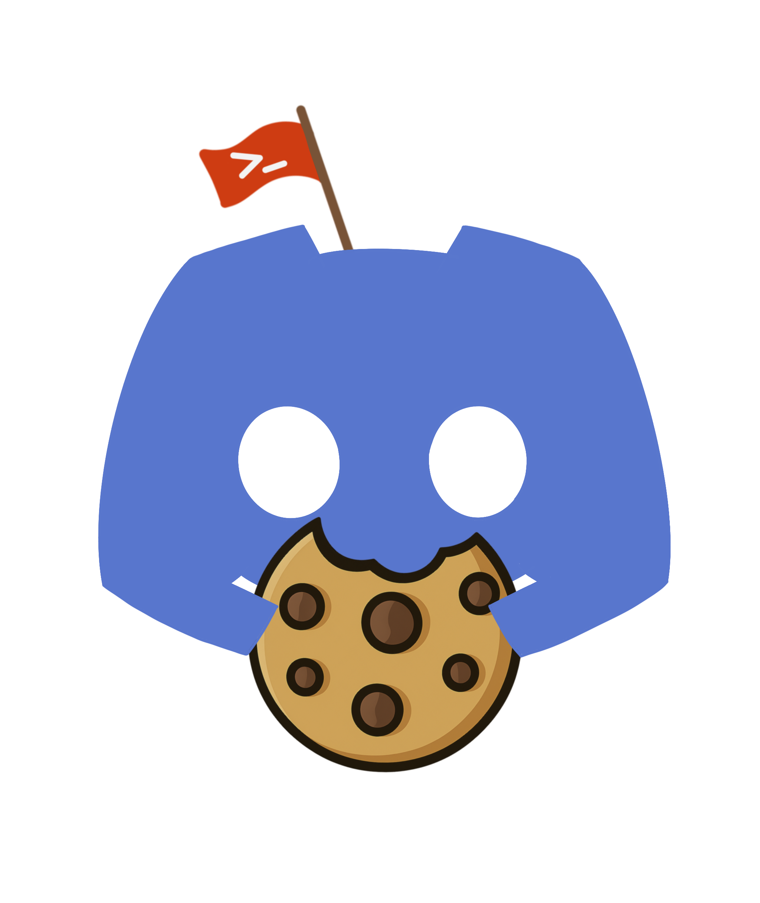

# DiscordCTFHelper

<div align="center">
  
</div>

> A powerful and customizable bot to manage and organize CTF competitions on Discord.

## Table of Contents

- [DiscordCTFHelper](#discordctfhelper)
  - [Table of Contents](#table-of-contents)
  - [About](#about)
  - [Features](#features)
  - [Installation](#installation)
    - [Prerequisites](#prerequisites)
    - [Steps](#steps)
  - [Usage](#usage)
  - [License](#license)
  - [To add](#to-add)
  - [Contact](#contact)

## About

**DiscordCTFHelper** is a Go bot built with `disgo` designed to streamline CTF (Capture The Flag) management on Discord servers. The bot integrates with CTFTime and provides essential features for tracking events, managing participants, and sharing updates.

## Features

- **Event Management**: Automatically fetch and display upcoming events from CTFTime.
- **Participant Management**: Track team members and roles within CTFs.
- **Notifications**: Send reminders for upcoming events and important milestones.
- **Event Archive**: Organize past event details for reference.
- **Customizable Status**: Display real-time bot activity.

## Installation

### Prerequisites

- Go 1.25.5 or later
- A Discord bot token (obtainable via the [Discord Developer Portal](https://discord.com/developers/applications))

### Steps

1. Clone this repository:

   ```bash
   git clone https://github.com/akiidjk/DiscordCTFHelper.git
   cd DiscordCTFHelper
   ```

2. Install dependencies:

   ```bash
   go mod download
   ```

3. Set up your `.env` file:
   Create a `.env` file in the root directory and include the following variables:

   ```env
   TOKEN=<discord_token>
   LOG_LEVEL=info
   LOG_FORMAT=text
   LOG_SOURCE=false
   ```

4. Run the bot:

   ```bash
   go run cmd/ctfhelper/main.go
   ```

   Optional flags (dev scope):
   - `--sync-commands`: Sync slash commands to Discord.
   - `--clean-commands`: Clean existing commands from Discord.

## Usage

- Invite the bot to your server using the generated OAuth2 link from the [Discord Developer Portal](https://discord.com/developers/applications).
- A user with admin role can run the command `/init` for the bot setup.
- Create a CTF with `/create`.

## License

This project is licensed under the Apache License. See the [LICENSE](LICENSE.md) file for details.

## Roadmap

- [x] Add final scraping for team stats
- [x] Add overall report generation
- [x] New handling of channel one channel only read width the banner show
- [x] Flag command
- [x] Reaction cookie and fire too each flag
- [x] Remove command
- [x] Creds command (command for store and show the creds of a ctf)
- [x] Send link to ctf message when channel is created
- [x] `/chall` command to add challenges
- [x] Migration to discordgo or disgo (not urgent)
- [x] `/vote` to vote next ctf (incomplete)

## Contact

For support or questions, feel free to open an issue or contact us directly
